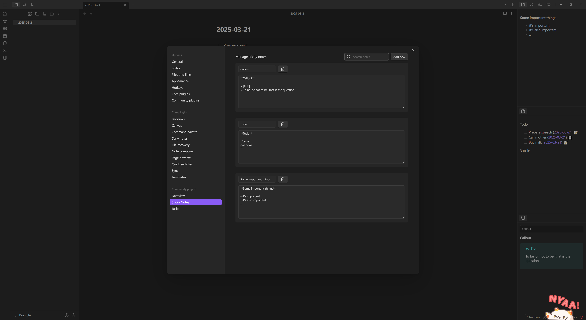

# Digital Sticky Notes Plugin

English | [中文](https://github.com/dalecgu/obsidian-sticky-notes/blob/master/README_zh.md)

📝 **​Simplify note management, never lose fragmented information**
A lightweight plugin that digitizes physical sticky notes, helping you quickly save, organize, and retrieve temporary notes.

## Plugin Purpose: Digital Replacement for Paper Sticky Notes
Upgrade your handwritten notes to:
- ​Permanently saved digital versions (No more loss or fading)
- ​Fully searchable content (Say goodbye to physical note shuffling)
- ​Markdown-enabled smart notes (Superior editing capabilities to paper)
- Integrated note system (Directly connected to your Obsidian knowledge base)

## Key Features

- **Quick Save**: One-click conversion of selected text into sticky notes
- ​**Dual View Modes**:
  - 📚 Selector View - Centralized management in sidebar
  - 📄 Single-Note View - Focused reading experience
- ​**Note Management**:
  - 🔍 Content search and filtering
  - ✏️ Real-time name/content editing
  - 🗑️ Effortless deletion
- ​**Markdown Support**: Full rendering of markdown formatting
- ​**Multiple Access Points**：
  - Sidebar ribbon icon
  - Command Palette shortcuts
  - Editor context menu

## Installation Guide

### Via BRAT (Recommended)
1. Install [BRAT Plugin](https://github.com/TfTHacker/obsidian42-brat)
2. Open Command Palette `Ctrl/Cmd+P`
3. Run `BRAT: Add a beta plugin`
4. Enter plugin repo URL`https://github.com/dalecgu/obsidian-sticky-notes`

### Manual Installation
1. Download latest release package
2. Extract to Obsidian plugins folder: `<vault>/.obsidian/plugins/obsidian-sticky-notes`
3. Reload Obsidian and enable plugin

## Usage Instructions

### Saving Notes
1. Select text in editor
2. Save using either method:
   - Right-click > "Save Selected Content As Sticky Note"
   - Command Palette > "Save Selected Content As Sticky Note"

### Accessing Notes
- ​**Selector View**：
  - Click notebook icon in sidebar ribbon
  - Command Palette > "Open Sticky Notes Selector View"
  - Use dropdown to switch between notes

- ​**Single Note View**：
  - Command Palette > "Open Sticky Notes Single Note View"
  - Each note opens in dedicated view

### Note Management
1. Open plugin settings
2. Available actions: 
   - 🔎 Real-time content filtering
   - ➕ Create blank notes
   - ✏️ Click-to-edit titles/content
   - 🗑️ Delete with trash icon
3. All changes autosave

## Contribution Guidelines
We welcome feature suggestions via issues and development contributions through Pull Requests!

## Support & Feedback
For technical issues or feature requests, please submit via [GitHub Issues](https://github.com/dalecgu/obsidian-sticky-notes/issues)

