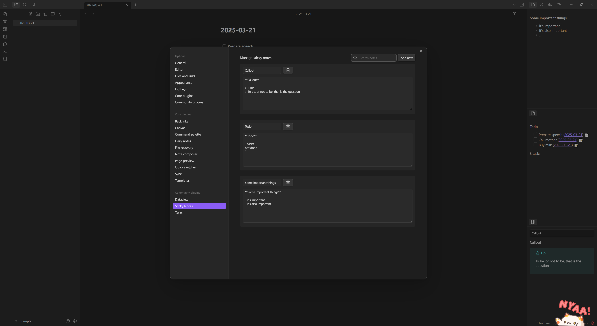

# Sticky Notes Plugin

[English](https://github.com/dalecgu/obsidian-sticky-notes/blob/master/README.md) | 中文

📝 ​**简化笔记管理，让碎片信息不再丢失**  
一个将实体便利贴电子化的轻量插件，帮助您快速保存、整理和查找临时笔记。

## 插件意图：纸质便利贴的数字替代方案
将您随手记录的纸质便利贴升级为：
- 永久保存的电子版（不怕丢失或褪色）
- 可全文搜索的数字内容（告别纸质便签的翻找）
- 支持Markdown格式的智能笔记（比纸质更强大的编辑能力）
- 与Obsidian联动的便签系统（直接整合到知识库中）

## 功能特性

- ​**快速保存**：一键保存编辑器中的选中文本为便签
- ​**双视图模式**：
  - 📚 便签选择器视图 - 侧边栏集中管理所有便签
  - 📄 单便签视图 - 专注查看单个便签内容
- ​**便签管理**：
  - 🔍 支持便签内容搜索过滤
  - ✏️ 实时编辑便签名称和内容
  - 🗑️ 便捷删除功能
- ​**Markdown渲染**：完美支持Markdown格式渲染
- ​**多入口访问**：
  - 侧边栏功能区图标
  - 命令面板快捷指令
  - 编辑器右键菜单

## 安装指南

### 通过BRAT安装（推荐）
1. 安装 [BRAT插件](https://github.com/TfTHacker/obsidian42-brat)
2. 打开命令面板 `Ctrl/Cmd+P`
3. 运行 `BRAT: Add a beta plugin`
4. 输入本插件仓库URL`https://github.com/dalecgu/obsidian-sticky-notes`

### 手动安装
1. 下载最新版本插件包
2. 解压到Obsidian插件目录：`<vault>/.obsidian/plugins/obsidian-sticky-notes`
3. 重新加载Obsidian并启用插件

## 使用说明

### 保存便签
1. 在编辑器中选中文本
2. 通过以下任一方式保存：
   - 右键菜单选择 "Save Selected Content As Sticky Note"
   - 命令面板运行 "Save Selected Content As Sticky Note"

### 访问便签
- ​**侧边栏选择器视图**：
  - 点击功能区笔记本图标
  - 命令面板运行 "Open Sticky Notes Selector View"
  - 通过下拉菜单切换查看不同便签

- ​**独立视图模式**：
  - 命令面板搜索 "Open Sticky Notes Single Note View"
  - 每个便签支持独立窗口查看

### 便签管理
1. 打开插件设置
2. 支持以下操作：
   - 🔎 搜索框实时过滤内容
   - ➕ 添加空白新便签
   - ✏️ 点击名称/内容直接编辑
   - 🗑️ 点击垃圾桶图标删除
3. 所有修改自动保存

## 贡献指南
欢迎通过 Issues 提交功能建议或通过 Pull Request 参与开发！

## 支持与反馈
如有使用问题或功能建议，请通过 [GitHub Issues](https://github.com/dalecgu/obsidian-sticky-notes/issues) 提交

